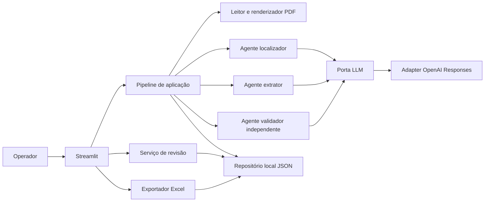
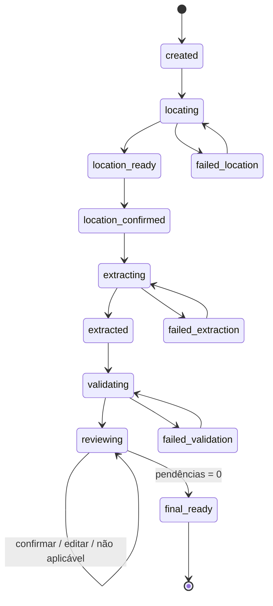

# Extração e Revisão de Regulamentos - Desenho

**Spec:** `.specs/features/regulation-extraction/spec.md`
**Contexto:** `.specs/features/regulation-extraction/context.md`
**Status:** Draft para aprovação

---

## Architecture Overview

A solução usa um núcleo Python independente de interface, uma orquestração explícita por estágios e adaptadores para PDF, LLM, persistência JSON e Excel. Streamlit apenas apresenta e aciona casos de uso; nenhuma regra de extração, confiança, revisão ou exportação fica na camada de UI.



### Abordagens consideradas

| Abordagem | Vantagens | Limitações | Decisão |
| --- | --- | --- | --- |
| Pipeline multimodal por estágios | Páginas confirmáveis, diagnóstico por etapa, tabelas preservadas, validação independente | Mais chamadas e mais estado | **Selecionada** |
| Uma chamada para localizar e extrair | Menos código e menor latência | Difícil corrigir páginas, depurar omissões e demonstrar separação de responsabilidades | Rejeitada |
| OCR local para Markdown antes da LLM | Controle local e possível redução de tokens | Adiciona dependência, perde estrutura de tabela e não é necessário nos PDFs fornecidos | Fallback futuro, não caminho principal |

O desenho segue a decisão já aprovada de localizar semanticamente, confirmar páginas e só então extrair.

---

## Fluxo por Estágios



Alterar as páginas confirmadas retorna a execução para `location_confirmed` e invalida extração, validação, revisões e arquivos Excel posteriores. Repetir apenas uma chamada falha não apaga estágios anteriores.

---

## Estratégia de Documento e LLM

1. Validar o PDF localmente, calcular SHA-256, contar páginas e criar a execução.
2. Enviar o PDF completo com detalhe econômico ao localizador, que retorna título, intervalo e justificativa em saída estruturada.
3. Renderizar localmente as páginas candidatas para a prévia do usuário.
4. Após confirmação, criar em memória ou em área temporária um PDF apenas com as páginas selecionadas.
5. Enviar a seção com alto detalhe visual ao extrator e exigir schema Pydantic estrito.
6. Enviar a seção e a lista de variáveis ao validador em chamada separada, sem raciocínio ou score do extrator.
7. Persistir cada resposta validada antes de avançar.

O adapter inicial usará a Responses API porque PDFs em modelos com visão incluem texto e imagens de página, preservando tabelas e documentos sem camada textual. O contrato do domínio não dependerá dessa API. A documentação oficial também recomenda Structured Outputs para aderência a JSON Schema, incluindo schemas derivados de Pydantic: [File inputs](https://developers.openai.com/api/docs/guides/file-inputs) e [Structured Outputs](https://developers.openai.com/api/docs/guides/structured-outputs).

### Separação entre os agentes

| Agente | Entrada | Saída | Não recebe |
| --- | --- | --- | --- |
| Localizador | PDF completo, descrição semântica da seção, capítulo opcional | Título, páginas, justificativa e sinais encontrados | Variáveis esperadas específicas do documento |
| Extrator | Páginas confirmadas, vocabulário preferencial, regras de atomicidade | Variáveis, valores, trechos, páginas, origem e cláusula | Score ou decisão de revisão |
| Validador | Páginas confirmadas e variáveis extraídas | Score, veredito, justificativa, problemas e suspeitas de omissão | Raciocínio ou confiança do extrator |

Os agentes podem usar o mesmo provedor, mas terão prompts versionados, chamadas, schemas e responsabilidades separados. `LOCATOR_MODEL`, `EXTRACTOR_MODEL` e `VALIDATOR_MODEL` serão configurações independentes.

### Rubrica de confiança

| Faixa | Interpretação |
| --- | --- |
| `0,95–1,00` | Valor explícito, completo e diretamente sustentado pela evidência. |
| `0,85–0,94` | Valor sustentado; apenas normalização ou síntese pequena. |
| `0,60–0,84` | Evidência parcial, ambígua, fragmentada ou dependente de contexto adicional. |
| `0,00–0,59` | Valor contraditório, não sustentado, ilegível ou ausente. |

O score não será recalculado por fórmula local. O roteamento usa `score < 0,85`, veredito e flags do validador. Casos adversariais versionados verificam se a rubrica discrimina erros conhecidos.

---

## Code Reuse Analysis

### Existing Components to Leverage

O repositório atual contém apenas os quatro PDFs e não oferece código reutilizável.

| Referência externa local | Uso conceitual | Restrição |
| --- | --- | --- |
| `production_rag/CONSTRAINTS.md` | Gates rápidos/completos, golden set e métricas sem regressão silenciosa | Não importar código nem infraestrutura do projeto |
| `production_rag/tests/evals/` | Manifesto versionado e integridade referencial da evidência | Adaptar as métricas ao domínio de extração |
| `juri_ai/evals/groundtruth/` | Relatórios reproduzíveis, custos e transparência sobre limitações | Evitar juízes LLM como única evidência |
| `fluxa_comex/tests/test_validador.py` | Mocks de API, respostas inválidas e contabilização de uso | Não copiar regras NCM nem padrões de extração determinística |

### Integration Points

| Sistema | Método de integração |
| --- | --- |
| OpenAI | Porta `LLMProvider`; adapter inicial com Responses API e Structured Outputs |
| Sistema de arquivos | Repositório de execuções com escrita atômica e diretórios por `run_id` |
| Excel | Adapter `openpyxl` que recebe modelos de domínio e não estado do Streamlit |
| Streamlit | Casos de uso síncronos, estado reidratado pelo repositório a cada ação |

---

## Components

### Modelos de domínio

- **Purpose:** Representar execução, localização, variável, validação, revisão e transições válidas sem dependência externa.
- **Location:** `src/asset_servicing/domain/`
- **Interfaces:**
  - `Run.transition(to_state: RunState) -> Run`
  - `Variable.apply_review(decision: ReviewDecision) -> Variable`
  - `Run.pending_items() -> list[ReviewItem]`
- **Dependencies:** Pydantic ou dataclasses; biblioteca padrão.
- **Reuses:** Nenhum componente atual.

### Pipeline de aplicação

- **Purpose:** Orquestrar estágios, persistência, retry e invalidação de resultados dependentes.
- **Location:** `src/asset_servicing/application/pipeline.py`
- **Interfaces:**
  - `create_run(document: Path) -> Run`
  - `locate_section(run_id: str, chapter_hint: int | None) -> SectionLocation`
  - `confirm_location(run_id: str, page_start: int, page_end: int) -> Run`
  - `extract(run_id: str) -> list[ExtractedVariable]`
  - `validate(run_id: str) -> ValidationBatch`
- **Dependencies:** Portas de PDF, LLM, relógio, IDs e repositório.
- **Reuses:** Nenhum componente atual.

### Serviço de revisão

- **Purpose:** Aplicar decisões humanas e proteger a evidência original.
- **Location:** `src/asset_servicing/application/review_service.py`
- **Interfaces:**
  - `confirm(variable_id: str) -> ExtractedVariable`
  - `edit(variable_id: str, name: str, value: str) -> ExtractedVariable`
  - `mark_not_applicable(variable_id: str, note: str) -> ExtractedVariable`
  - `add_missing(finding_id: str, name: str, value: str, evidence: str) -> ExtractedVariable`
- **Dependencies:** Repositório local e modelos de domínio.
- **Reuses:** Nenhum componente atual.

### Porta e adapters de LLM

- **Purpose:** Isolar o domínio do SDK e permitir mocks, gravações e troca de modelo.
- **Location:** `src/asset_servicing/ports/llm.py`, `src/asset_servicing/adapters/llm/openai_responses.py`
- **Interfaces:**
  - `locate(request: LocateRequest) -> SectionLocation`
  - `extract(request: ExtractionRequest) -> ExtractionBatch`
  - `validate(request: ValidationRequest) -> ValidationBatch`
- **Dependencies:** SDK do provedor apenas no adapter; schemas Pydantic compartilhados.
- **Reuses:** Padrão de mocks observado nos projetos de referência.

### Processador PDF

- **Purpose:** Validar, contar, renderizar e selecionar páginas sem interpretar o conteúdo do domínio.
- **Location:** `src/asset_servicing/adapters/pdf/processor.py`
- **Interfaces:**
  - `inspect(path: Path) -> DocumentMetadata`
  - `render_pages(path: Path, pages: list[int]) -> list[PagePreview]`
  - `select_pages(path: Path, start: int, end: int) -> bytes`
- **Dependencies:** Biblioteca PDF definida após spike curto; sem OCR obrigatório.
- **Reuses:** PDFs existentes como fixtures reais.

### Repositório local

- **Purpose:** Persistir e reidratar execuções por arquivos JSON versionados por schema.
- **Location:** `src/asset_servicing/adapters/persistence/json_repository.py`
- **Interfaces:**
  - `save_run(run: Run) -> None`
  - `load_run(run_id: str) -> Run`
  - `append_event(event: RunEvent) -> None`
- **Dependencies:** Escrita em temporário seguida de `os.replace`.
- **Reuses:** Nenhum componente atual.

### Exportador Excel

- **Purpose:** Produzir workbooks preliminar e final a partir do estado de domínio.
- **Location:** `src/asset_servicing/adapters/export/excel.py`
- **Interfaces:**
  - `export_preliminary(run: Run) -> Path`
  - `export_final(run: Run) -> Path`
- **Dependencies:** `openpyxl`.
- **Reuses:** Contrato exato do case.

### Interface Streamlit

- **Purpose:** Apresentar o fluxo, prévias, resultados, fila de revisão e downloads.
- **Location:** `src/asset_servicing/ui/app.py`
- **Interfaces:** chamadas aos serviços de aplicação; nenhum acesso direto ao SDK da LLM.
- **Dependencies:** Streamlit e repositório pela camada de aplicação.
- **Reuses:** Nenhum componente atual.

---

## Data Models

```python
class RunState(str, Enum):
    CREATED = "created"
    LOCATING = "locating"
    LOCATION_READY = "location_ready"
    LOCATION_CONFIRMED = "location_confirmed"
    EXTRACTING = "extracting"
    EXTRACTED = "extracted"
    VALIDATING = "validating"
    REVIEWING = "reviewing"
    FINAL_READY = "final_ready"
    FAILED_LOCATION = "failed_location"
    FAILED_EXTRACTION = "failed_extraction"
    FAILED_VALIDATION = "failed_validation"


class SectionLocation(BaseModel):
    title: str
    page_start: int
    page_end: int
    rationale: str
    confirmed: bool = False


class ExtractedVariable(BaseModel):
    id: str
    canonical_name: str
    original_name: str
    original_value: str
    current_name: str
    current_value: str
    evidence_text: str
    source_pages: list[int]
    source_kind: Literal["table", "prose", "human_added"]
    clause_reference: str | None
    reviewed: bool = False
    review_status: Literal["pending", "confirmed", "edited", "not_applicable"]


class ValidationResult(BaseModel):
    variable_id: str
    confidence: float
    verdict: Literal["supported", "partially_supported", "unsupported"]
    rationale: str
    issues: list[str]


class CoverageFinding(BaseModel):
    id: str
    description: str
    suggested_name: str | None
    evidence_text: str
    source_pages: list[int]
    review_status: Literal["pending", "accepted", "dismissed"]


class ReviewDecision(BaseModel):
    variable_id: str
    action: Literal["confirm", "edit", "not_applicable", "add_missing"]
    previous_name: str | None
    previous_value: str | None
    resulting_name: str | None
    resulting_value: str | None
    note: str | None
    reviewed_at: datetime
```

### Layout de persistência

```text
data/runs/<run_id>/
├── source.pdf
├── run.json
├── extraction.json
├── validation.json
├── reviews.json
├── events.jsonl
├── previews/
└── exports/
    ├── preliminary.xlsx
    └── final.xlsx
```

Arquivos de runtime ficam fora do Git. O golden set referencia os PDFs originais por hash e não depende de `data/runs/`.

---

## Excel Contract

### Aba `Variáveis`

| Coluna | Tipo | Regra |
| --- | --- | --- |
| `Variável` | texto | Nome vigente da variável |
| `Valor da variável` | texto | Valor vigente; não aplicáveis são omitidos da aba principal |
| `Trecho da variável` | texto | Evidência original imutável, prefixada com página quando necessário |
| `Grau de Confiança` | decimal | Score original do validador entre 0 e 1 |
| `Foi revisado?` | booleano | Verdadeiro somente após decisão humana |

### Aba `Auditoria`

Inclui `run_id`, documento, SHA-256, páginas confirmadas, estado do export, modelos, versões de prompt, tempos, tokens/uso reportado, valores anteriores e decisões de revisão. O conteúdo não altera o contrato da aba principal.

---

## Test Strategy

### Pirâmide

| Camada | Escopo | Rede/API |
| --- | --- | --- |
| Unitários | Transições, threshold, invalidação, revisão, tipos do Excel | Nunca |
| Contrato | Schemas dos três agentes, refusal, resposta incompleta e inválida | Nunca; fixtures gravadas e mocks |
| Integração local | PDF real, persistência, retomada e workbook | Nunca |
| Evals offline | Golden set, evidência, erros sem suporte e cenário Capítulo 6 | Nunca |
| UI | Fluxo Streamlit com serviços fakes e downloads | Nunca |
| Smoke real | Um documento e chamadas reais configuradas | Opt-in |

### Golden set

```text
evals/golden/v1/
├── manifest.yaml
├── expected/
│   ├── DOC_REGUL_23183_193223_2026_05.yaml
│   ├── DOC_REGUL_23968_193595_2026_05.yaml
│   ├── DOC_REGUL_24029_193593_2026_05.yaml
│   └── DOC_REGUL_30148_163257_2025_10.yaml
├── adversarial_cases.yaml
└── chapter_6_fixture.yaml
```

Cada variável esperada registra identificador estável, nomes aceitos, valores aceitos, criticidade, páginas e trecho literal curto. O manifesto registra SHA-256 dos PDFs, versão do schema, anotador e data. Alterações no golden set e no baseline devem aparecer separadamente de mudanças que tentam melhorar o pipeline.

### Métricas e gates

| Métrica | Gate inicial |
| --- | --- |
| Integridade de evidência | 100% dos trechos do golden set resolvem na página declarada |
| Cobertura de campos críticos nos quatro PDFs | 100% |
| Valor correto dos campos críticos | 100% |
| Encaminhamento de erros adversariais para revisão | 100% |
| Localização do cenário Capítulo 6 | 1 de 1 |
| Schema e tipos do Excel | 100% dos casos contratuais |
| Suíte offline | Zero falhas, sem rede e sem chave |

Campos de texto narrativo não serão avaliados por igualdade integral. O golden set definirá fatos obrigatórios e evidência; equivalência semântica poderá gerar relatório auxiliar, mas não substituirá verificações determinísticas de presença, página e suporte.

### Matriz requisito-teste

| Requisitos | Evidência principal |
| --- | --- |
| ASET-01–07 | Testes de entrada, locator fake, PDF Capítulo 6 e ajuste manual |
| ASET-08–15 | Contrato do extrator e integração com PDFs com/sem tabela |
| ASET-16–23 | Contrato do validador e conjunto adversarial |
| ASET-24–32 | Unitários do serviço de revisão e retomada do repositório |
| ASET-33–40 | Inspeção programática do workbook e bloqueio do final |
| ASET-41–47 | Fault injection de timeout, rate limit, schema e segredo sentinela |
| ASET-48–54 | Harness offline, manifesto e smoke opt-in |
| ASET-55–57 | Postergado até todos os gates P1 passarem |

---

## Error Handling Strategy

| Cenário | Tratamento | Impacto para o usuário |
| --- | --- | --- |
| PDF inválido ou acima do limite | Rejeitar antes de criar chamada paga | Mensagem específica e nenhum estado parcial enganoso |
| Seção não localizada | Salvar falha de localização e aceitar páginas manuais | Execução continua recuperável |
| Timeout, rate limit ou rede | Backoff com jitter, máximo de três tentativas | Progresso anterior preservado |
| Refusal ou schema inválido | Marcar estágio falho, salvar metadados e oferecer retry | Nenhum resultado parcial tratado como válido |
| Falha de persistência | Interromper antes da etapa seguinte | Evita estado apenas em memória |
| Evidência não encontrada | Criar pendência de revisão | Erro não passa silenciosamente |
| Alteração de páginas | Invalidar artefatos posteriores | UI explica quais resultados serão refeitos |
| Excel final com pendências | Bloquear no domínio e na UI | Preliminar continua disponível |

---

## Security and Data Handling

- Credenciais são lidas de ambiente; `.env` e `data/runs/` ficam no `.gitignore`.
- Prompts instruem os agentes a tratar o conteúdo do PDF como dado não confiável e ignorar instruções encontradas nele.
- Logs não armazenam chave, cabeçalhos de autorização nem o corpo completo do documento.
- Os documentos são públicos, mas o README explicará que uma API externa recebe o PDF durante localização, extração e validação.
- Uploads são limitados por tipo, tamanho e quantidade de páginas antes de qualquer chamada externa.
- A aplicação não executa código, links ou anexos referenciados pelo PDF.

---

## Observability

Cada evento registra `run_id`, `stage`, `event`, `status`, `started_at`, `duration_ms`, `model`, `prompt_version`, `input_pages`, uso reportado e erro sanitizado. A UI exibe apenas status útil; o arquivo `events.jsonl` conserva detalhes para diagnóstico e relatório da apresentação.

Um resumo por execução mostrará:

- duração por estágio e total;
- número de variáveis extraídas, aprovadas e revisadas;
- distribuição de scores;
- número de chamadas e retries;
- tokens ou uso reportado pelo provedor;
- versão dos prompts e modelos.

---

## Risks & Concerns

| Concern | Location | Impact | Mitigation |
| --- | --- | --- | --- |
| Repositório ainda não inicializado | raiz do projeto | Sem histórico, branch ou proteção contra segredos | Inicializar Git antes da implementação, adicionar `.gitignore` e usar commits atômicos |
| Apenas quatro documentos reais | `Regulamentos/` | Golden set pequeno pode superestimar generalização | Adicionar cenário sintético Capítulo 6 e casos adversariais; declarar a limitação |
| Score da LLM não é calibrado | validador | Usuário pode interpretar confiança como probabilidade | Rubrica explícita, threshold conservador e teste adversarial |
| Extrator e validador podem compartilhar vieses | adapters LLM | Erro consistente pode passar pelos dois | Prompts independentes, nenhuma confiança compartilhada, modelos configuráveis e mutações adversariais |
| PDF completo enviado à API | adapter OpenAI | Custo, latência e transferência externa | Documentos públicos, localização com detalhe econômico e extração apenas das páginas confirmadas |
| Escrita em arquivos sem banco | repositório JSON | Corrupção em interrupção | Escrita temporária, `fsync` quando aplicável e `os.replace` |
| Documento surpresa muda mais que o esperado | localizador/extrator | Seção pode não ser localizada ou vocabulário não cobrir regra | Nomes dinâmicos, ajuste manual de páginas e ausência de tabela permitida |
| Testes de LLM podem ser não determinísticos | smoke/evals | Flakiness e custo em CI | Suíte offline bloqueante; smoke real separado, gravado e explicitamente opt-in |

---

## Tech Decisions

| Decision | Choice | Rationale |
| --- | --- | --- |
| Linguagem | Python | Ecossistema de PDF, LLM, Excel, testes e experiência existente |
| Interface | Streamlit | Fluxo local rápido, formulário, tabelas editáveis e downloads |
| Arquitetura | Domínio + aplicação + portas/adapters | Mantém regras testáveis sem Streamlit ou rede |
| Persistência | JSON/JSONL por execução | Auditável, simples e suficiente sem banco |
| Entrada da LLM | PDF multimodal por estágio | Preserva texto e layout de tabelas |
| Saída da LLM | Structured Outputs derivados de Pydantic | Um schema único para runtime e validação |
| Excel | `openpyxl` | Controle de tipos, abas e formatação |
| Confiança | Score do validador com rubrica e threshold `0,85` | Transparência e roteamento reproduzível |
| Testes de API | Mocks e respostas gravadas; smoke opt-in | Reprodutibilidade sem custo ou segredo |
| Busca natural | Flag P3 desligada até gates P1 | Preserva foco do case |

---

## Delivery Boundary

Esta fase entrega somente contexto, especificação e desenho. Não cria código, não escolhe dependências definitivas, não chama a API paga e não cria tarefas de implementação. Após aprovação, o próximo passo é decompor o P1 em tarefas atômicas com gates e commits.
